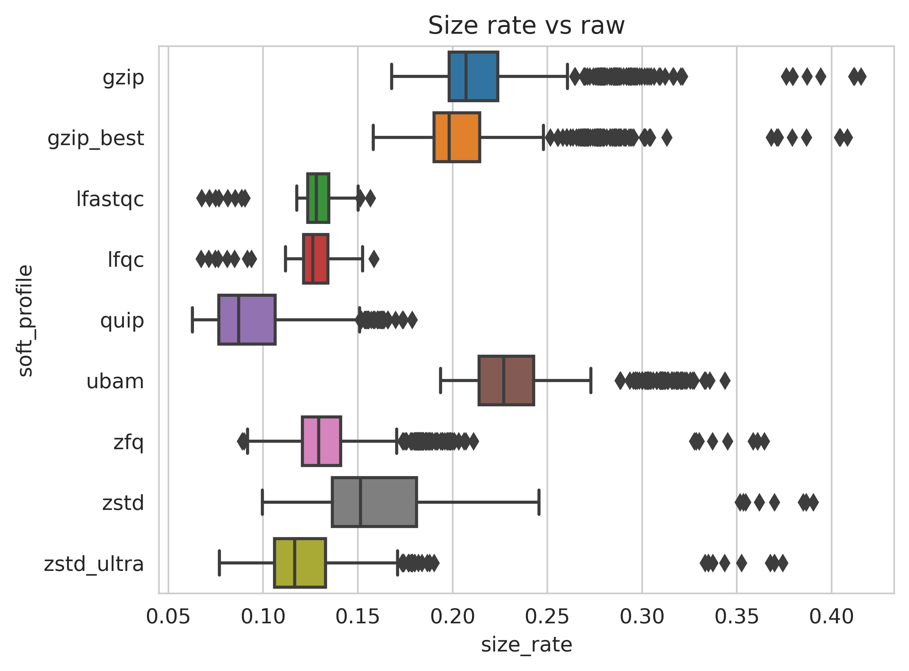
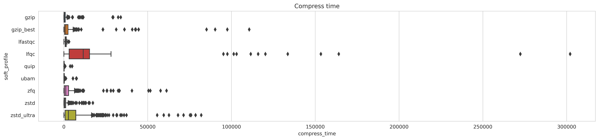
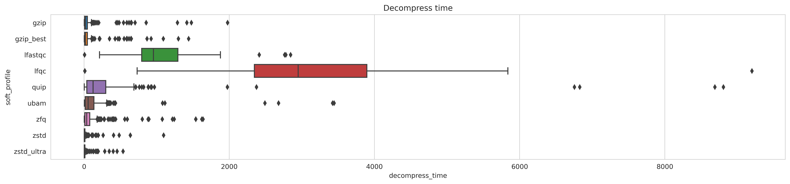
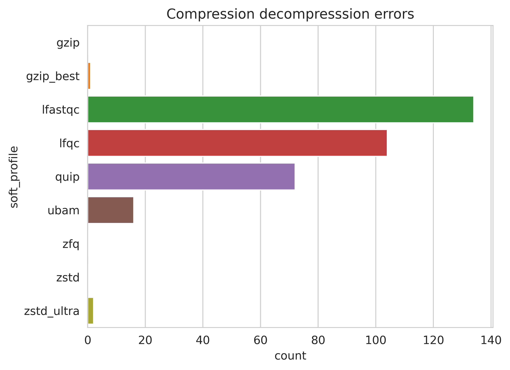

# zfq: FastQ file compressor

## Table of Contents
* [Description](#description)
* [Installation](#installation)
* [Usage example](#usage_example)
* [How it works](#how_it_works)
* [Benchmarks](#benchmarks)
* [Copyright](#copyright)


## Description
zfq is a **lossless** compression/uncompression wrapper for FastQ files.

### Key features:
* Universal:
  * zfq is based on a non-specialized compression algorithm. This somewhat
  reduces its compression performance, but means it can handle any FastQ (no
  character limit in sequences headers or qualities).
  * Without reference genome.
* Robust:
  * Wraps well maintained and tested standard software: zstd.
  * Decompression result is automatically tested after each compression.
  * md5sum of the original file is stored to be automatically tested after each
  decompression.
  * No failures on the benchmark dataset of 645 files from Element Biosciences,
  Illumina and PacBio instruments.
* Efficient:
  * Compression rate is better than widely used gzip (up to 2 times better than
  gzip best), similar to zstd in ultra mode and lower than sequence compression
  algorithms like quip (up to half).
* Userfriendly:
  * gzipped fastq can be directly take as input or written to output.
  * `zfq info` instantly provides the number of sequences and nucleotids stored
  in the file.


## Installation

Requirements :
* python (`>=3.7`)
* [zstd](https://github.com/facebook/zstd) (`>=1.4.4`) a fast lossless
compression algorithm developped by meta.

Build: ```python -m pip install zfq```


## Usage example

### Compress fastq(.gz) file:
Command:
`zfq.py compress -t 2 -i SRR.fastq.gz -o SRR.fastq.zfq -r`

Options in example:
  * `-r/--remove` is used to remove zfq file after decompression. 
  * `-t/--threads` number of compression threads. 

STDERR:
```
zfq.py compress -i SRR.fastq.gz -o SRR.fastq.zfq
2023-09-05 11:48:20,483 -- [zfq.py][pid:3163205][INFO] -- Command: zfq.py compress -t 2 -i SRR.fastq.gz -o SRR.fastq.zfq
2023-09-05 11:48:21,341 -- [zfq.py][pid:3163205][INFO] -- End of job
```

### Get information from original file:
Command:
`zfq.py info -i SRR.fastq.zfq`

STDOUT:
```
{"seq": 14615, "nt": 1865822, "md5": "c1f5e805b3a076d5c58fa206f2c30ac5", "mtime": 1693907258.333263}
```

### Convert zfq to fastq.gz
Command:
`zfq.py uncompress -i SRR.fastq.zfq -o SRR2.fastq.gz -r`

Option in example:
  * `-r/--remove` is used to remove zfq file after decompression. 

STDERR:
```
2023-09-05 11:55:42,348 -- [zfq.py][pid:3164218][INFO] -- Command: zfq.py uncompress -i SRR.fastq.zfq -o SRR2.fastq.gz -r
2023-09-05 11:55:44,066 -- [zfq.py][pid:3164218][INFO] -- End of job
```


## How it works

Compress:

  1. Write number of reads, nucleotides, modification time and original md5sum
  in info file.
  2. Split FastQ into three parts: headers, sequences (no new line) and qualities.
  3. Compress each part with zstd.
  4. Store all compressed files and input info in a tar archive.
  5. Apply the original modification time to archive.
  6. Decompress the file into a temporary file to compare md5sum of the original
  file and decompressed file.

Decompress:
  1. Extract files.
  2. Decompress with zstd.
  3. Merge each part (sequences are splitted according to quality length).
  4. Apply original modification time to decompressed file.
  5. Compare md5sum of the original file (from info file) and decompressed file.


## Benchmarks

### Software

* Text compression:
  * gzip (https://www.gnu.org/software/gzip/) in two modes: *default* and *best*.
  * zstd (https://github.com/facebook/zstd) in two modes: *13* and *ultra 22*.


* Sequences compression:
  * lfastqc (https://github.uconn.edu/sya12005/LFastqC)
  * lfqc (https://github.com/mariusmni/lfqc)
  * picard (https://broadinstitute.github.io/picard/command-line-overview.html)
  to convert as uBAM
  * quip (https://github.com/dcjones/quip)
  * zfq

### Dataset

 * 645 files
 * Sequencers types: Element Biosciences (AVITI), Illumina (MiSeq, NextSeq
 and NovaSeq) and PacBio (Sequel 2)
 * Library: amplicon, capture and whole
 * Matrix: DNA, ctDNA and RNA
 * Species: Homo sapiens and sevreal virus

### Results
#### Compression rate and time

* Compression rate better than widely used gzip (up to 2 times better than gzip
best), similar to zstd in ultra mode and lower than sequence compression
algorithms like quip (up to half).


* Compression faster than zstd ultra and lfqc, similar to gzip best and slower
than quip.

#### Decompression time

Faster than ubam, quip, lfastqc and lfqc and slower than gzip, and others.

#### Error rate

* Sequence compression algorithms failed to compress or decompress several files
in the dataset. This was due to memory requirements (> 200G) or limited quality
range. This was very problematic in cases where compression was performed without
apparent error and decompression was not possible because the file was invalid.
* Text compression algorithms can convert every type of fastq.


## Copyright
2023 CHU Toulouse
